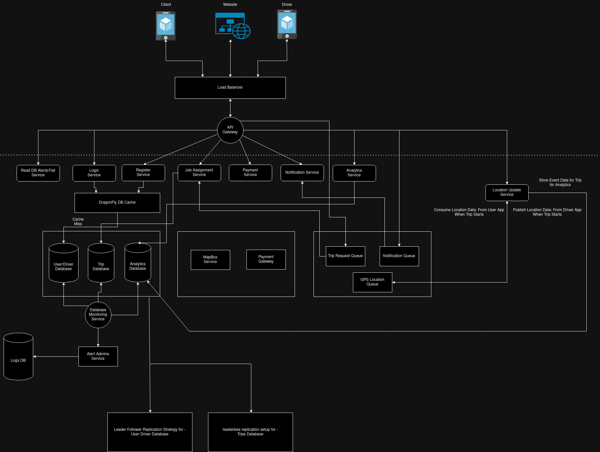
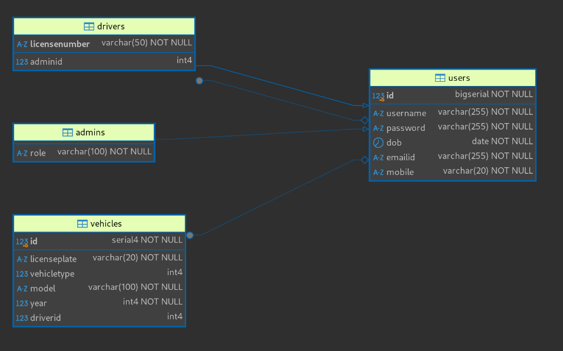
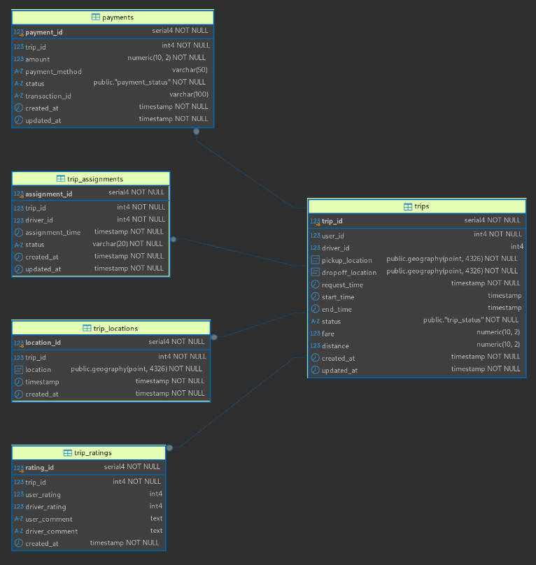

# Loggistics Connect App

## Proposed Designs

**Services**

 - User Service: Responsible for CRUD operations on Users Table(Clients)
 - Driver Service: Responsible for CRUD operations on Data in Driver Table
 - Job Assignment Service: Consumes Trip Requests from Message Queue and matches drivers with Users, shows available options
 - Location Updation Service: 
    * From Driver: Publish Data to GPS location queue
    * From User : Consume Data from GPS location queue and display on MapBox
 - Payments Service: Routes to Payment Gateway and stores status in Trips DB
 - Notification Service: Sends Push Notifications about Trip details like completion, payment etc to both User and Driver By consuming from notification queue
 - Analytics Service: For System Admins, Presents required trip analytics from Analytics DB

Each service is designed in a layered architecture:
1. Transport Layer(Handler and main server) 
2. Business Logic
3. Service
4. Storage

### ER Diagrams

User ERD:

Trips ERD:

### Tools Used
 - Nginx : Load Balancing
 - Go : Create Microservices and API Gateways
 - PostgreSQL : Relational Database for Users and Trips DB(ER Diagrams present)
 - ClickHouse : Analytics DB(Not implemented/Used in current solution)

## Analysis of current System

### Pros
 - Independent and highly decoupled componenets in form of microservices
 - Seperation on Databases according to intesiveness of operations
 - Usage of message queues promotes asynchronus processing of requests and allows for quick data sharing using pub-sub model

### Cons
 - No failover strategies added for databases
 - Monitoring only limited to databases
 - Limited caching due to the real time nature of the system

## Requirements

### Functional Requirements -
 - Users can see available drivers in vicinity
 - Users can provide target location
 - Users can see upfront price, data about vehicle and current demand
 - Drivers can accept/reject incoming requests
 - Drivers can update the status of delievery
 - Admins of driver agencies can manage available vehicles, montior driver activity.
 - Admins can analyze booking data
 - Admins can see basic analytics like
    * Trips completed
    * Average Trip Time
    * Driver Performance

### Non Functional Requirements
 - Load Balancing 
 - Various Replication strategies for Databases for High availability
 - Monitoring of Databases and all services

## Database Design

### Users DB 

READ HEAVY DB 

Stores all users and primarily used by auth service. Has a table called Users and two tables called Drivers and Admins that inherit from this table. 
We also have a separate table called Vehicle to register individual vehicles.
According to the design, a driver can either be associated to an admin/company or be an individual contractor 

## Trips DB
WRITE HEAVY DB

The schema includes tables like trips, which stores details such as trip IDs, user and driver identifiers, geographic pickup and dropoff locations (using PostGIS Geography type), timestamps for various trip stages, and trip statuses. The trip_assignments table manages driver assignments, while the trip_locations table tracks real-time trip locations. The payments table records payment transactions with statuses and amounts, and the trip_ratings table captures ratings and comments from users and drivers. Indexes enhance query performance across critical fields, and triggers automatically update timestamps for record modifications. Overall, the schema effectively utilizes PostgreSQL and PostGIS for managing spatial data and improving application efficiency in the job assignment service.