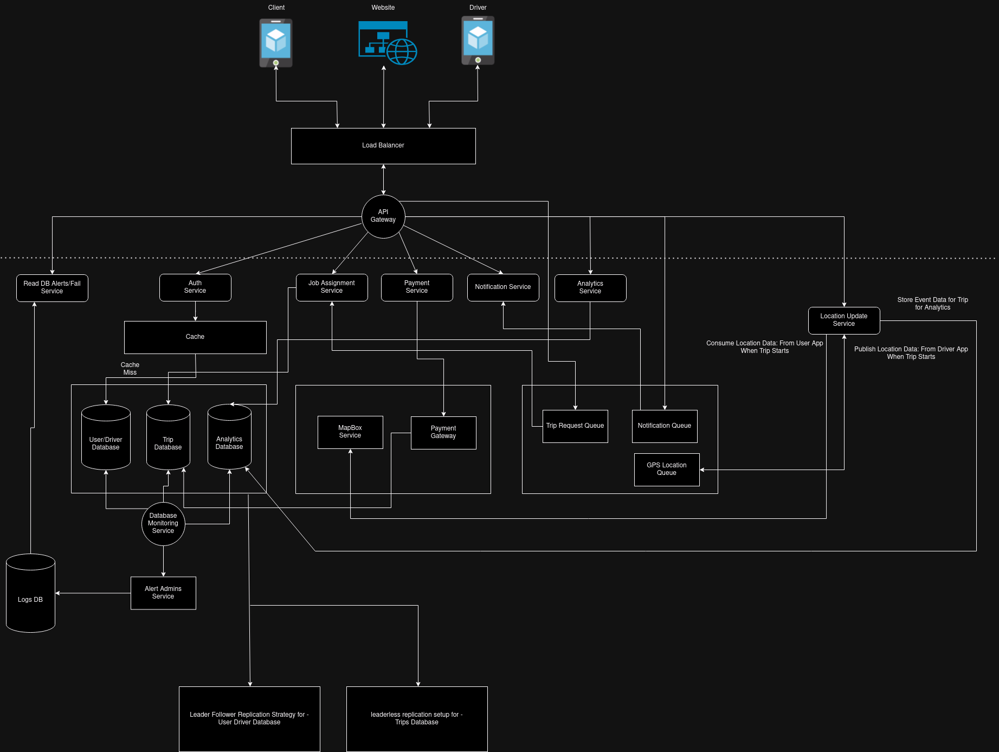

# Loggistics Connect App

## Proposed Designs

## Requirements

### Functional Requirements -
 - Users can see available drivers in vicinity
 - Users can provide target location
 - Users can see upfront price, data about vehicle and current demand
 - Drivers can accept/reject incoming requests
 - Drivers can update the status of delievery
 - Admins of driver agencies can manage available vehicles, montior driver activity.
 - Admins can analyze booking data
 - Admins can see basic analytics like
    * Trips completed
    * Average Trip Time
    * Driver Performance

## Database Design

Primary Tables:
 - User: Can be of type client, driver and admin

# References

https://shivaani27.medium.com/integrating-postgresql-with-go-a-complete-guide-with-a-task-management-example-ce1c860a168b

# Rough Notes

 - Represent locations only as latitude, longitudes and pincodes internally to reduce search space.
